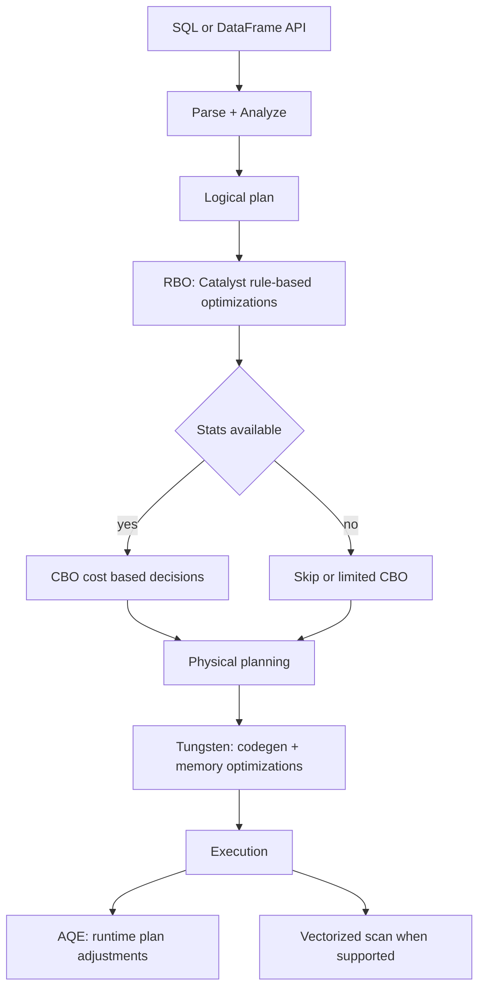

# Topic 6: Spark Optimizations and Spark Issues and Troubleshooting

## 🎯 Learning Goals

By the end of this topic, you should be able to:
- **Optimizations:** Explain Spark default optimization methods (RBO, CBO, AQE), Catalyst, predicate/projection pushdown, column/partition pruning, constant folding, join reordering; Tungsten and vectorized execution; and how they apply to tables vs DataFrames
- **Engineer practices:** Know what to do so inbuilt optimizations work better (filters, column selection, statistics, skew, partitioning) and what extra optimizations to add (repartition, coalesce, broadcast, etc.)
- Identify and resolve common Spark OutOfMemory (OOM) errors
- Understand and fix data skewness issues in Spark
- Handle small files problem in Spark and Hive
- Troubleshoot Spark job failures (FileAlreadyExistsException, FileNotFoundException)
- Optimize Spark configurations for performance
- Apply techniques like repartition, coalesce, broadcast joins, and salting
- Understand GC tuning and YARN memory overhead
- Handle updates and deletes in Spark

---

## 📖 Part 1: Spark Optimizations

### Spark default optimization methods (overview)

Spark applies optimizations in several layers:

1. **Catalyst optimizer** (always enabled) – applies rule-based and cost-based transformations to the logical and physical plan before execution.
2. **RBO (Rule-Based Optimizer)** – predefined transformation rules; no data statistics needed.
3. **CBO (Cost-Based Optimizer)** – uses table/column statistics to choose join order and strategies (enabled by default in Spark 3.0+).
4. **AQE (Adaptive Query Execution)** – adjusts at runtime based on actual data (Spark 3.x).
5. **Tungsten** – memory management and code generation.
6. **Vectorized execution** – batch processing in columnar format where supported (e.g. Parquet).

#### Optimization flow (what runs first?)



#### Pushdown & pruning: where they act

```mermaid
flowchart LR
  Q[Query: filter + select] --> P[Catalyst]
  P --> RBO[RBO: rewrite plan]
  RBO --> DS[Data source scan]
  DS -->|Predicate pushdown| DS
  DS -->|Projection pushdown| DS
  DS -->|Partition pruning (if partitioned)| DS
  DS --> EX[Executors process fewer rows/cols]
```

---

### Differences between Spark 2.0, 3.0, and 4.0 (optimizations)

| Area | Spark 2.x | Spark 3.x | Spark 4.x (expected) |
|------|-----------|-----------|------------------------|
| **CBO** | Off by default; must enable `spark.sql.cbo.enabled` | On by default; join reorder, better broadcast | Further refinements |
| **AQE** | Not available | AQE enabled by default (coalesce, skew join, join strategy switch) | More adaptive features |
| **RBO** | Catalyst RBO (predicate pushdown, pruning, etc.) | Same + more rules | Continued expansion |
| **Dynamic partition pruning** | Limited | Improved for dynamic filters | — |
| **Join hints** | Broadcast hint | Broadcast, shuffle, merge, etc. | — |
| **Python** | Row-by-row UDFs | Pandas UDFs / vectorized UDFs | — |

---

### RBO – Rule-Based Optimizer (how Catalyst handles it)

RBO applies **predefined transformation rules** to the logical (and physical) plan **without using data statistics**. Catalyst runs these rules during query planning.

**Common RBO types:**

- **Predicate pushdown**
- **Projection pushdown**
- **Constant folding**
- **Column pruning**
- **Partition pruning**
- **Join reordering** (when combined with CBO)
- **Remove redundant operations**

---

#### Predicate pushdown

- **What it does:** Pushes filter conditions down to the **data source** so the storage layer returns only matching rows instead of reading everything and filtering in Spark.
- **Example:** `spark.read.parquet("path")` then `df.filter(age > 30)`. With predicate pushdown, Spark tells the reader “only give rows where age > 30”; the file format (e.g. Parquet) can skip row groups and return fewer rows.
- **Benefits:** Less data read from disk, less data transferred over the network, and fewer rows in the execution plan early on → much faster.
- **Default:** Usually on for Parquet/ORC and other supported sources. Can be explicitly enabled via Spark config (e.g. filter pushdown settings) when supported.

---

#### Projection pushdown

- **What it does:** Pushes **column selection** down to the data source so only **required columns** are read from storage.
- **Why it matters:** Columnar formats (Parquet, ORC, Delta) store data by column. Reading only needed columns skips entire column chunks.
- **Benefits:** Fewer disk reads, less network traffic, less memory, smaller data footprint in memory and during shuffle.

---

#### Constant folding

- **What it does:** Spark evaluates **constant expressions once at query planning time** and replaces them with the result, so they are not recomputed for every row.
- **Example:** `df.withColumn("x", lit(some_constant_formula))` – if `some_constant_formula` is constant, Spark replaces it with `lit(result)` instead of computing it per row.
- **Benefits:** Removes repeated calculations, reduces CPU and I/O, and simplifies the execution plan.

---

#### Column pruning

- **What it does:** Removes **unnecessary columns** from the logical and physical plan so downstream operators only see columns that are actually used.
- **Column pruning vs projection pushdown:**

| | Column pruning | Projection pushdown |
|---|----------------|---------------------|
| **Where** | In Spark’s plan | At the data source |
| **Effect** | Drops columns from the execution plan | Avoids reading those columns from disk |
| **Formats** | Any | Columnar (Parquet, ORC, etc.) only |
| **Plan level** | Logical + physical | Physical scan |

---

#### Partition pruning

- **What it does:** Skips **entire partitions**; only **required partitions** are scanned instead of reading all data.
- **Condition:** Only possible if the **table is partitioned** (e.g. by date, region). Filters on partition columns allow skipping partition directories/files.
- **Limitation:** If the table (e.g. Delta) is not partitioned, partition pruning does not apply.

---

### Join reordering (RBO/CBO)

- **What it does:** Spark changes the **order of joins** to reduce intermediate data size and improve performance.
- **Example:** A = 100M rows, B = 10M, C = 10K. Naive order `A.join(B).join(C)` produces a huge intermediate result. Optimized order can be `A.join(C)` first (smaller result), then join with B → smaller intermediate data.
- **Config (CBO):** Join reordering is driven by CBO when statistics are available:
  - `spark.sql.cbo.enabled = true`
  - `spark.sql.cbo.joinReorder.enabled = true`

---

### Storage and statistics (for CBO)

CBO needs **statistics** to make good decisions:

- Table: row count, size
- Columns: cardinality, number of distinct values, data distribution (histograms where available)

**How to populate:** Run **`ANALYZE TABLE`** (and optionally `COMPUTE STATISTICS`) so Spark/Delta stores these in the table metadata. CBO then uses them to choose join strategies and join order.

---

### CBO – Cost-Based Optimizer (how it works)

- **What it does:** Uses **table and column statistics** to estimate query cost and choose **optimal join order and execution strategies**, reducing shuffle and intermediate data size.
- **Decisions:** CBO decides based on statistics (row counts, sizes, cardinality), not just rules. It optimizes join structure; the physical plan is derived from that, and execution uses the chosen strategies.
- **CBO enables:**
  - Join reordering
  - Better choice of broadcast joins
  - Improved AQE behavior
  - Smarter physical plans

**Default:** CBO is usually **on by default in Spark 3.0+**. Ensure statistics are collected (e.g. `ANALYZE TABLE`) for best effect.

---

### Tungsten Engine optimizations

Tungsten improves **memory and CPU efficiency**:

- **Off-heap memory** and compact binary in-memory representation
- **Whole-stage code generation** – fuses operators and generates JVM bytecode to avoid per-row virtual calls
- **Cache-friendly layouts** – data laid out for efficient access

These apply under the hood to both DataFrame and SQL execution.

---

### AQE (Adaptive Query Execution)

- **What it is:** Runtime re-optimization based on **actual** data sizes and shuffle statistics (Spark 3.x, on by default in many distributions).
- **Features:** Dynamic coalesce of shuffle partitions, skew join handling, switching join strategy (e.g. sort-merge to broadcast) when runtime stats justify it.
- **Benefit:** Reduces need to guess partition counts and helps with skew and join strategy mistakes.

---

### Vectorized execution

- **What it is:** Processing data in **columnar batches** instead of row-by-row, especially for Parquet (and similar) reads.
- **Benefit:** Better CPU cache use and fewer virtual calls; can significantly speed up scans and columnar operations.
- **Scope:** Typically applies to reads and certain operations in the engine; not all UDFs are vectorized.

---

### How these work on tables vs DataFrames

- **Tables (catalog):** When you query a table (e.g. `spark.sql("SELECT ... FROM my_table")` or `spark.table("my_table")`), Catalyst, RBO, CBO, AQE, Tungsten, and vectorized execution all apply during planning and execution. Statistics from `ANALYZE TABLE` are used by CBO for catalog tables.
- **DataFrames (API):** The same optimizations apply. DataFrame operations are translated into a logical plan and then optimized the same way. So `df.filter(...).select(...).join(...)` gets predicate pushdown, column pruning, join reorder (with CBO), etc. Statistics for CBO are used when the DataFrame was built from a catalog table or when statistics are available for the source.

---

### What to do as an engineer so inbuilt optimizations work better

1. **For RBO to work well:**
   - **Filter early** and on columns that can be pushed down (avoid filtering only after heavy shuffles).
   - **Select only needed columns** so column pruning and projection pushdown can drop the rest.
   - Avoid redundant operations and unnecessary broad selects.

2. **For CBO to work well:**
   - **Keep statistics up to date:** Run `ANALYZE TABLE ... COMPUTE STATISTICS` (and column stats if needed) on key tables.
   - **Avoid heavily skewed join keys** and tune partitioning so CBO’s size estimates and join choices are valid.
   - Use **partitioning** that matches common filters so partition pruning can kick in.

3. **For AQE to help:**
   - Let it run (enabled by default in 3.x); use a reasonable initial partition count so AQE can coalesce or rebalance effectively.

---

### Optimizations you can add beyond the inbuilt ones

These are **explicit** choices you make in code or config; they complement the automatic optimizations above.

1. **Repartition**
   - **What:** Changes partition count via a **full shuffle**; redistributes data evenly (or by expression).
   - **When:** Before large joins (repartition both sides by join key to align partitions and reduce skew), when you need more parallelism, or when data is skewed and you want even-sized partitions.
   - **Example:** `df.repartition(300, "cust_id")` before a join; do the same for the other DataFrame on the same key.
   - **Cost:** Shuffle is expensive (network + disk); use when the benefit (faster join, less skew) outweighs it.

2. **Coalesce**
   - **What:** **Reduces** partition count by **merging** existing partitions; **no shuffle**.
   - **When:** To decrease partitions (e.g. before write to avoid many small files), when you already have skewed or “ballooned” partitions and want fewer, or to limit output file count. **Not** ideal for fixing skew (can create uneven partitions).
   - **Example:** `df.coalesce(5)` before `write.save(...)`.
   - **Rule of thumb:** Repartition → performance (even distribution, parallelism). Coalesce → cleanup (fewer partitions/files).

3. **Broadcast join**
   - Use broadcast hint for small tables/dimensions so one side is sent to all executors and no big shuffle is needed.

4. **Salting**
   - Add a random salt to skewed join keys to spread hot keys across more partitions and reduce skew (see troubleshooting section later).

5. **Partitioning at write**
   - Pre-partition by a key (e.g. `df.repartition("date").write.partitionBy("date").save(...)`) so reads can use partition pruning and joins can be more efficient.

6. **Caching**
   - Cache only when a dataset is reused multiple times; unpersist when done to free memory.

---

## 📖 Part 2: Common Spark Issues and Solutions

### Most Common Causes of OOM (OutOfMemory) Errors

1. **Incorrect usage of Spark** - Using `collect()` on large datasets, improper caching
2. **Inefficient queries** - Not filtering early, unnecessary shuffles, cartesian joins
3. **Driver Memory Exhaustion** - Collecting too much data to driver, large broadcast variables
4. **Executor Memory Exhaustion** - Insufficient executor memory, data skew, large partitions
5. **Large data processing** - Processing more data than cluster can handle
6. **Incorrect configuration** - Unoptimized data partitions, wrong memory settings
7. **Skewed Data Distribution** - Uneven data distribution causing some executors to run out of memory

---

## 🔴 Issue 1: Executor OutOfMemory (OOM)

### Symptoms
- Job fails with `java.lang.OutOfMemoryError: Java heap space`
- Tasks fail repeatedly on specific executors
- Spark UI shows some executors taking much longer than others

### Root Causes

**1. Insufficient Executor Memory**
- Executor doesn't have enough memory to process its partition
- Common when processing large datasets without proper partitioning

**2. Data Skew**
- Some partitions have significantly more data than others
- A few executors process huge partitions while others are idle

**3. Inefficient Operations**
- Multiple filters and joins without optimization
- Large shuffle operations without repartitioning

### Solutions

#### Solution 1: Adjust Number of Partitions (Repartition)

**Problem**: Job with multiple filters and joins running slow and failing with OOM.

**Solution**: Use `repartition()` before joins to evenly distribute data.

```python
# Before: Skewed partitions causing OOM
df1.join(df2, "join_key")

# After: Repartition before join
df1_repartitioned = df1.repartition("join_key")
df2_repartitioned = df2.repartition("join_key")
result = df1_repartitioned.join(df2_repartitioned, "join_key")
```

**Why repartition helps**:
1. **Reduces Skew** → If one partition has significantly more data than others, some tasks will take longer. `repartition()` ensures even distribution.
2. **Minimizes Shuffle Data** → Spark performs shuffle joins, which require moving data across partitions. Optimizing partitions reduces shuffle overhead.
3. **Improves Parallelism** → With better partitioning, all worker nodes process data in parallel, speeding up execution.

#### Solution 2: Use Appropriate Caching

Cache intermediate results that are reused across multiple stages.

```python
# Cache DataFrame that will be reused
df_filtered = df.filter("status = 'active'").cache()

# Use it multiple times
df1 = df_filtered.join(other_df1, "id")
df2 = df_filtered.join(other_df2, "id")

# Unpersist when done
df_filtered.unpersist()
```

**Best Practices**:
- Cache only DataFrames that are used **multiple times**
- Use appropriate storage level: `MEMORY_ONLY`, `MEMORY_AND_DISK`, `DISK_ONLY`
- Unpersist when no longer needed to free memory

#### Solution 3: Increase Executor Memory

OOM errors often occur when the Spark executor does not have enough memory.

```python
# Increase executor memory
spark.conf.set("spark.executor.memory", "8g")
spark.conf.set("spark.executor.memoryFraction", "0.8")

# Or via spark-submit
# spark-submit --executor-memory 8g --driver-memory 4g
```

**Configuration**:
- `spark.executor.memory`: Total memory per executor
- `spark.executor.memoryFraction`: Fraction of memory for caching (default 0.6)
- `spark.executor.cores`: Number of cores per executor (affects parallelism)

**Note**: If more cores are assigned than required, they need metadata overhead, which can reduce available memory for data processing.

---

## 🔴 Issue 2: Driver OutOfMemory (OOM)

### Symptoms
- Driver JVM runs out of memory
- Job fails when calling actions like `collect()`, `take()`, `show()`
- Error: `java.lang.OutOfMemoryError` in driver logs

### Root Causes

**1. Collecting Too Much Data**
- `collect()` brings all data from all workers to the driver
- Driver JVM cannot hold large datasets

**2. Large Broadcast Variables**
- Broadcasting DataFrame that's too large
- Broadcast variable must fit in driver and each executor memory

**3. Driver Memory Too Small**
- Driver memory insufficient for metadata and operations

### Solutions

#### Solution 1: Avoid Collecting Large Datasets

```python
# ❌ Bad: Collecting entire DataFrame
all_data = df.collect()  # Can cause driver OOM

# ✅ Good: Use actions that don't bring all data to driver
df.show(100)  # Shows only first 100 rows
df.take(100)  # Returns only first 100 rows
df.count()    # Returns only count, not data

# ✅ Good: Write to storage instead of collecting
df.write.parquet("output_path")
```

#### Solution 2: Check Driver JVM Settings

```python
# Increase driver memory
spark.conf.set("spark.driver.memory", "4g")
spark.conf.set("spark.driver.maxResultSize", "2g")

# Or via spark-submit
# spark-submit --driver-memory 4g --driver-max-result-size 2g
```

**Configuration**:
- `spark.driver.memory`: Memory allocated to driver JVM
- `spark.driver.maxResultSize`: Maximum size of result that can be returned to driver (prevents accidental large collects)

#### Solution 3: Use Broadcast Join Correctly

Broadcast join sends smaller DataFrame to all executors. If the DataFrame is too large, it causes driver OOM.

```python
from pyspark.sql.functions import broadcast

# ✅ Good: Broadcast small DataFrame (< 10MB by default)
small_df = df.filter("size < 1000")  # Small DataFrame
large_df = df.filter("size > 10000")  # Large DataFrame

result = broadcast(small_df).join(large_df, "join_key", "left")

# ❌ Bad: Broadcasting large DataFrame
# result = broadcast(large_df).join(small_df, "join_key")  # Driver OOM!
```

**Broadcast Join Threshold**:
```python
# Increase threshold if needed (default 10MB)
spark.conf.set("spark.sql.autoBroadcastJoinThreshold", "50mb")
```

**When to use broadcast join**:
- Smaller DataFrame fits in executor memory
- Join key distribution is even
- Avoid if smaller DataFrame is still large (> 100MB typically)

---

## 🔴 Issue 3: GC Overhead Limit Exceeded

### Error
```
java.lang.OutOfMemoryError: GC overhead limit exceeded
```

### What is Garbage Collection?

**Garbage** refers to memory that is no longer being used or referenced by the program, but has not been explicitly freed. This memory is called "garbage" because it is no longer needed by the program and can be safely discarded.

**GC Overhead Limit Exceeded** occurs when:
- The program generates too much garbage
- Garbage collector spends more than 98% of time cleaning up memory
- Less than 2% of heap is recovered after GC
- Indicates insufficient memory or too many temporary objects

### Understanding GC Process

**Heap Memory Regions**:
- **Eden**: New objects are allocated here
- **Survivor 1 & Survivor 2**: Objects that survive minor GC
- **Old Generation (OldGen)**: Long-lived objects

**GC Procedure**:
1. When **Eden is full**, a **minor GC** runs on Eden
2. Objects alive from Eden and Survivor1 are copied to **Survivor2**
3. Survivor regions are swapped
4. If object is old enough or Survivor2 is full, it moves to **Old Generation**
5. When **Old is close to full**, a **full GC** is invoked

**Problem**: If full GC is invoked multiple times before a task completes, it means there isn't enough memory available for executing tasks.

### Solutions

#### Solution 1: Collect GC Statistics

First step: Collect statistics on GC frequency and time spent.

```python
# Enable GC logging
spark.conf.set("spark.executor.extraJavaOptions", 
    "-XX:+UseParallelGC -verbose:gc -XX:+PrintGCDetails -XX:+PrintGCTimeStamps")

# Or via spark-submit
# --conf spark.executor.extraJavaOptions="-XX:+UseParallelGC -verbose:gc -XX:+PrintGCDetails"
```

**Analyze GC logs**:
- Frequency of GC (minor vs full)
- Time spent in GC
- Memory recovered after GC
- If GC time > 20% of total time → need more memory or reduce object creation

#### Solution 2: Increase Memory for GC

```python
# Increase executor memory
spark.conf.set("spark.executor.memory", "8g")

# Increase memory fraction for execution (reduce cache fraction)
spark.conf.set("spark.executor.memoryFraction", "0.7")  # More for execution
spark.conf.set("spark.storage.memoryFraction", "0.3")   # Less for caching
```

#### Solution 3: Use G1GC (Garbage First Garbage Collector)

G1GC is better for large heaps and reduces GC pause times.

```python
# Use G1GC instead of ParallelGC
spark.conf.set("spark.executor.extraJavaOptions", 
    "-XX:+UseG1GC -XX:MaxGCPauseMillis=200")

# Or via spark-submit
# --conf spark.executor.extraJavaOptions="-XX:+UseG1GC -XX:MaxGCPauseMillis=200"
```

#### Solution 4: Reduce Temporary Objects

**Filter Early**: Reduce data size before joins/aggregations
```python
# ❌ Bad: Join first, filter later
result = df1.join(df2, "key").filter("date > '2024-01-01'")

# ✅ Good: Filter early, join later
df1_filtered = df1.filter("date > '2024-01-01'")
df2_filtered = df2.filter("date > '2024-01-01'")
result = df1_filtered.join(df2_filtered, "key")
```

**Use Persist Instead of Cache**: For large DataFrames, use disk persistence
```python
# Cache uses memory (can cause GC pressure)
df.cache()

# Persist to disk reduces memory pressure
df.persist(StorageLevel.DISK_ONLY)
# Or hybrid
df.persist(StorageLevel.MEMORY_AND_DISK)
```

**Reduce Shuffle**: Use repartition before joins
```python
# Repartition reduces shuffle data
df1 = df1.repartition("join_key")
df2 = df2.repartition("join_key")
result = df1.join(df2, "join_key")
```

**Enable Adaptive Query Execution (AQE)**: Spark 3.0+ feature that optimizes at runtime
```python
spark.conf.set("spark.sql.adaptive.enabled", "true")
spark.conf.set("spark.sql.adaptive.coalescePartitions.enabled", "true")
```

### Summary: How to Fix GC Overhead Limit Exceeded

✅ **Increase Memory** → `--executor-memory 8g --driver-memory 4g`  
✅ **Reduce Shuffle** → Use `repartition()` before joins  
✅ **Enable AQE** → `spark.conf.set("spark.sql.adaptive.enabled", "true")`  
✅ **Persist Instead of Cache** → `df.persist(StorageLevel.DISK_ONLY)`  
✅ **Use G1GC** → `--conf spark.executor.extraJavaOptions="-XX:+UseG1GC"`  
✅ **Filter Early** → Reduce data size before joins  

---

## 🔴 Issue 4: YARN Memory Overhead

### What is YARN Memory Overhead?

**YARN memory overhead** refers to the additional memory beyond the actual executor memory that YARN reserves for its internal processes and operations. It is necessary to allocate memory for YARN's own needs, apart from the memory allocated to Spark executors, to ensure the smooth functioning of the cluster.

### Components

**1. YARN Container Overhead**
- Memory required by YARN to manage the container and its associated processes
- Includes: YARN ApplicationMaster, task isolation, logging, and other YARN-specific functionalities
- **Default**: YARN reserves **10% of executor memory** (minimum 384MB)

**2. YARN Off-Heap Memory**
- YARN allocates off-heap memory for storing metadata and data structures related to container management
- Off-heap memory is outside the Java heap space and managed directly by the operating system

### Configuration

```python
# Set YARN overhead (default is 10% or 384MB, whichever is larger)
spark.conf.set("spark.yarn.executor.memoryOverhead", "1024")  # MB

# Or via spark-submit
# --conf spark.yarn.executor.memoryOverhead=1024
```

**Total Container Memory** = `spark.executor.memory` + `spark.yarn.executor.memoryOverhead`

**Example**:
- `spark.executor.memory = 8g`
- `spark.yarn.executor.memoryOverhead = 1g` (or 10% = 800MB)
- **Total container memory = 9g**

### When to Increase Overhead

- If you see **YARN container killed** errors
- If executors are being killed by YARN (not Spark OOM)
- When using off-heap storage (e.g. Tachyon/Alluxio)
- When processing large objects or strings

---

## 🔴 Issue 5: Small Files Problem

### Problem

**what are small files:**
Spark processes data in parallel using tasks, where each task operates on a single Spark partition. However, when writing to partitioned tables, a single task may write data to multiple table partitions depending on how data is distributed across partition keys.

Spark partitions control parallelism during execution, while table partitions control physical data layout in storage. Misalignment between execution partitions and table partitions can lead to file fragmentation and performance degradation.

**Spark partitions** These are data chunks inside Spark’s memory.
df = spark.read.parquet("s3://data/")
df.rdd.getNumPartitions()
If it says 100 →
Your DataFrame has 100 Spark partitions.
Important:
1 Spark partition → processed by 1 task
Controls parallelism
Exists during execution

**Shuffle partitions**
These are created only during shuffle operations.
Triggered by:
groupBy
join
distinct
repartition
orderBy
Controlled by:
spark.conf.get("spark.sql.shuffle.partitions")
Default = 200
When shuffle happens: Spark redistributes data, Creates N shuffle partitions
Each becomes 1 task in next stage
They are just a special type created during redistribution.

**Table partitions**
These are physical directories in storage.
df.write.partitionBy("date").save("path")
/path/date=2026-03-01/
/path/date=2026-03-02/
/path/date=2026-03-03/

These are NOT Spark partitions.
They are:
Folder-level organization
Used for partition pruning
Purely storage-level optimization

**Tasks**
A task is the smallest unit of execution.
1 Spark partition = 1 task
If you have:

200 Spark partitions
4 executors × 4 cores = 16 cores total

Then:
16 tasks run in parallel
Remaining 184 wait

✔️ 1 Task can write to multiple Table Partitions

**How to Identify Small File Issues**
Storage-Level Deep Inspection: Count files per partition folder
Delta Table Metadata Deep Check: `DESCRIBE DETAIL table_name;`
Spark UI – Advanced Analysis: Stage shows 10,000 tasks, Total input = 50GB, Each task ≈ 5MB , That’s a small file pattern.
Scheduler Delay: the time a task spends waiting before it actually starts executing on an executor.
Query Behavior Patterns: count(*) is slow, Simple filter query is slow, Reading even small date partitions takes long

I first calculate average file size from table metadata and inspect file count per partition. Then I analyze Spark UI to check input size per task, total task count, and scheduler delay. Small file problems typically show excessive task counts with low input size per task and disproportionate scheduling overhead. Additionally, I validate cloud storage API request patterns and driver CPU utilization to confirm metadata overhead is dominating execution.

**Why do we get small files:**
Small file problems can originate at both execution and storage layers. 
At the execution layer, excessive shuffle partitions or repartitioning creates many output files. 
At the storage layer, poor table partitioning strategy or frequent MERGE operations cause file fragmentation within partition directories. The worst cases occur when execution partitioning and table partitioning are misaligned.

1. Too Many Spark Partitions at Write Time
   `df.repartition(2000).write.format("delta").save()`
   You create 2000 Spark partitions, 2000 tasks, Each task writes at least one file
   This is purely execution-level partitioning problem, not table partitioning.

2. Shuffle Partitions Too High:
   `spark.sql.shuffle.partitions = 2000`
   2000 partitions created, 2000 tasks write files,Even if table isn't partitionedd, you still get 2000 files.

3. Streaming / Micro-Batches:
   Processes small data,Writes output files

4. Small Files Caused by Table Partitioning Strategy (Storage-Level Issues):
   Over-Partitioning by High Cardinality Column
   `df.write.partitionBy("user_id")`

5. Many Table Partitions + Many Spark Partitions
- `spark.sql.shuffle.partitions = 200`
- Target table partitioned by `date` (50 partitions)
- Each of 200 tasks can write to 50 partitions
- **Result**: 200 × 50 = **10,000 files per load**
- If loading 4 times/day → **40,000 files per day**

### Why Small Files Are Bad
Small files introduce excessive metadata overhead, increase task scheduling costs, and reduce IO efficiency. 
In cloud object storage environments, listing and opening thousands of small files significantly increases latency. A
dditionally, excessive Spark tasks caused by small files create driver pressure and inefficient CPU utilization. 
Proper file sizing and compaction are essential for maintaining scalable performance.

- **Query latency**: Reading many small files is slower than reading fewer large files
- **Metadata overhead**: Many small files = heavy metadata operations.
    Spark must: List files, Fetch metadata, Open file handles
Read file footers (Parquet metadata)

- **Inefficient I/O**: Many small I/O operations instead of fewer large ones, Lower throughput per task

### Solutions in Spark

#### Solution 1: Repartition on Partition Keys

```python
# Repartition on the same column(s) used for partitioning
df = df.repartition("date", "region")  # Match partitionBy columns

df.write.partitionBy("date", "region").parquet("output_path")
```

**Why**: Ensures each task writes to a single partition, reducing file count.

#### Solution 2: Repartition on Derived Column

If partition keys don't distribute evenly, create a derived column that divides each partition equally.

```python
from pyspark.sql.functions import hash, col

# Create derived column that evenly distributes data
df = df.withColumn("hash_bucket", hash("id") % 100)

# Repartition on partition key + hash bucket
df = df.repartition("date", "hash_bucket")

df.write.partitionBy("date").parquet("output_path")
```

**Why**: Ensures each task has same amount of data and loads into single partition.

#### Solution 3: Use Coalesce

Combine all output files into fewer files (but be careful - reduces parallelism).

```python
# Coalesce to reduce number of output files
df.coalesce(10).write.partitionBy("date").parquet("output_path")
```

**When to use**:
- Final write stage (no more processing needed)
- Small dataset that doesn't need 200 partitions
- **Warning**: Coalesce reduces parallelism - use only when appropriate

#### Solution 4: Set maxRecordsPerFile

Limit number of records per output file.

```python
# Limit records per file (creates new file when limit reached)
df.write.option("maxRecordsPerFile", 500000) \
    .partitionBy("date") \
    .parquet("output_path")
```

**When to use**: When you want consistent file sizes without reducing parallelism.

### Solutions in Hive

#### Solution 1: Hive Merge Properties

Enable Hive's merge files properties to combine small files.

```sql
-- Merge small files at the end of map-only job
SET hive.merge.mapfiles=true;

-- Merge small files at the end of map-reduce job
SET hive.merge.mapredfiles=true;

-- Size of merged files at the end of the job
SET hive.merge.size.per.task=256000000;  -- 256MB

-- When average output file size < this, start merge job
SET hive.merge.smallfiles.avgsize=128000000;  -- 128MB
```

**How it works**:
- Hive checks average output file size
- If average < `hive.merge.smallfiles.avgsize`, starts additional map-reduce job
- Merges files into bigger files (up to `hive.merge.size.per.task`)

#### Solution 2: Reduce Number of Reducers

```sql
-- Set reducers to 1 to avoid small files
SET mapreduce.job.reduces=1;
```

**Trade-off**: Reduces parallelism but ensures single output file.

#### Solution 3: Hive on Tez Engine

```sql
-- Enable Tez file merging
SET hive.merge.tezfiles=true;
SET hive.merge.smallfiles.avgsize=128000000;
SET hive.merge.size.per.task=128000000;
```

#### Solution 4: Bash Script to Merge Files

Create a script to merge small files in HDFS and create temp table.

```bash
#!/bin/bash
# Merge small files in HDFS
hdfs dfs -getmerge /source/path/* /local/merged_file.parquet
hdfs dfs -put /local/merged_file.parquet /target/path/

# Create temp table and insert into final table
hive -e "CREATE TEMPORARY TABLE temp_table ... LOCATION '/target/path/';
         INSERT INTO final_table SELECT * FROM temp_table;"
```

### Best Practices

- **Partition by columns that distribute evenly** (e.g. date, region)
- **Repartition before write** on partition keys
- **Use coalesce** only in final write stage
- **Set maxRecordsPerFile** for consistent file sizes
- **Enable Hive merge properties** for Hive tables
- **Monitor file count** and set alerts

---

## 🔴 Issue 6: Data Skewness in Spark

### What is Data Skewness?

**Data skewness** occurs when some partitions contain significantly more data than others, leading to uneven workload distribution among executors.

**Unevenly distributed data** is called **Skewed Data**.

### Symptoms

- **Slow job execution**: Some tasks take much longer than others
- **Memory issues**: Executors running out of memory on skewed partitions
- **Poor resource utilization**: Some executors idle while others are overloaded
- **Job stuck**: Job appears stuck at last stage (e.g., 199/200 tasks complete, one task taking forever)

### Common Causes

**1. Join Operations**
- Joining datasets on a key that has significant skewness
- Example: Joining on `user_id` where one user has millions of records, others have few

**2. Aggregation Operations**
- Grouping by skewed column
- Example: `GROUP BY country` where one country has 80% of data

**3. Null Values**
- Too many null values in join key
- All nulls go to same partition

### Example: Skewed Join Problem

**Scenario**: Join 2 DataFrames, one highly skewed on join column, other evenly distributed. Both have millions of records. Job gets stuck at last stage (199/200 tasks).

**What happens**:
- Spark performs **Shuffle Hash Join** by default
- Spark hashes join column and sorts it
- Tries to keep records with same hashes in same partition on same executor
- **Highly skewed DataFrame** causes problems: one partition has huge data, others are small

### Solutions

#### Solution 1: Join with Different Key (Best)

If possible, use a different join key that distributes more evenly.

```python
# ❌ Bad: Joining on skewed key
result = df1.join(df2, "user_id")  # user_id is highly skewed

# ✅ Good: Use different key or composite key
result = df1.join(df2, ["user_id", "session_id"])  # Composite key distributes better
```

#### Solution 2: Broadcast Join

Copy smaller dataset to all nodes using broadcast join.

```python
from pyspark.sql.functions import broadcast

# Broadcast smaller DataFrame (must fit in executor memory)
small_df = df.filter("size < 1000")  # Small DataFrame
large_df = df.filter("size > 10000")  # Large DataFrame

result = broadcast(small_df).join(large_df, "join_key", "left")
```

**How it works**:
- Smaller DataFrame is copied to all worker nodes as broadcast variable
- Original parallelism of larger DataFrame is maintained
- No shuffle needed - join happens locally on each executor

**When to use**:
- Smaller DataFrame < 10MB (or configured threshold)
- Smaller DataFrame fits in executor memory
- Avoid if smaller DataFrame is still large

**Configuration**:
```python
# Increase broadcast threshold (default 10MB)
spark.conf.set("spark.sql.autoBroadcastJoinThreshold", "50mb")
```

#### Solution 3: Data Preprocessing

Preprocess data to handle nulls and outliers before join.

```python
# Handle null values in join key
df1 = df1.filter(col("join_key").isNotNull())
df2 = df2.filter(col("join_key").isNotNull())

# Or replace nulls with a special value
df1 = df1.fillna({"join_key": "NULL_KEY"})
df2 = df2.fillna({"join_key": "NULL_KEY"})

# Then join
result = df1.join(df2, "join_key")
```

#### Solution 4: Repartition Before Join

Repartition DataFrames on join key before joining.

```python
# Repartition on join key to ensure even distribution
df1 = df1.repartition("join_key")
df2 = df2.repartition("join_key")

# Then join
result = df1.join(df2, "join_key")
```

**Best Practice**: Always repartition your data based on join column before huge operations.

#### Solution 5: Key Salting (Advanced)

**Salting** = Adding a random value to join key to redistribute data evenly.

**Idea**: Invent a new key that guarantees even distribution.

**Steps**:
1. Add uniformly distributed column to large DataFrame (salt value: 0 to N)
2. Explode small DataFrame: create rows for each old_id and each salt value (0 to N)
3. Join on salted keys
4. Aggregate to remove salt and get final result

```python
from pyspark.sql.functions import col, explode, array, lit, hash

# Step 1: Add salt to large DataFrame
salt_buckets = 10
df_large = df_large.withColumn("salt", hash(col("join_key")) % salt_buckets)

# Step 2: Explode small DataFrame (create rows for each salt)
salt_array = array([lit(i) for i in range(salt_buckets)])
df_small = df_small.withColumn("salt", explode(salt_array))

# Step 3: Join on salted keys
result = df_large.join(df_small, ["join_key", "salt"], "inner")

# Step 4: Aggregate to remove salt (if needed)
result = result.groupBy("join_key").agg(...)
```

**When to use**: When join key is highly skewed and other methods don't work.

#### Solution 6: Cache DataFrames Before Heavy Operations

```python
# Cache DataFrames before heavy operations
df1 = df1.cache()
df2 = df2.cache()

# Use take(1) to execute cache
df1.take(1)
df2.take(1)

# Then perform join
result = df1.join(df2, "join_key")
```

**Why**: Caching optimizes performance by avoiding recomputation.

### Detection: How to Identify Skew

**Spark UI**:
- Check **Stage** view: look for tasks with much longer duration than others
- Check **Executor** view: some executors processing much more data
- Check **Shuffle Read/Write**: uneven distribution

**Code**:
```python
# Check partition sizes
partition_sizes = df.rdd.mapPartitions(lambda x: [len(list(x))]).collect()
print(f"Min: {min(partition_sizes)}, Max: {max(partition_sizes)}, Avg: {sum(partition_sizes)/len(partition_sizes)}")

# If max >> avg, you have skew
```

---

## 🔴 Issue 7: FileAlreadyExistsException

### Error
```
org.apache.spark.SparkException: Job aborted due to stage failure: 
Task failed while writing: FileAlreadyExistsException
```

### Root Causes

**1. Previous Task Failure**
- Failure of previous task might leave some files that trigger the exception
- When executor runs out of memory, Spark's dynamic resource allocation redistributes tasks
- Tasks originally on overloaded executor may have already created files
- When rescheduled on another executor, they attempt to write to same location

**2. Executor Failure and Rescheduling**
- When executor fails (hardware, network, OOM), Spark restarts it and reschedules failed task
- If failed task had already written files before failure, rescheduled task tries to write to same location
- FileAlreadyExistsException occurs because task doesn't know file was already written

**3. Concurrent Writes**
- Multiple jobs writing to same path simultaneously
- No coordination between jobs

### Solutions

#### Solution 1: Identify Original Executor Failure

**In Spark UI**:
1. Check **Executors** tab for failed executors
2. Check **Stages** tab for failed tasks
3. Look at **logs** for OOM errors or other failures
4. Identify root cause (memory, network, hardware)

#### Solution 2: Optimize Resource Allocation

```python
# Prevent OOM that causes executor failures
spark.conf.set("spark.executor.memory", "8g")
spark.conf.set("spark.executor.memoryFraction", "0.8")

# Disable dynamic allocation if causing issues
spark.conf.set("spark.dynamicAllocation.enabled", "false")
```

#### Solution 3: Fine-Tune Retry Settings

```python
# Configure retry behavior
spark.conf.set("spark.task.maxFailures", "4")  # Max retries per task
spark.conf.set("spark.stage.maxConsecutiveAttempts", "4")  # Max stage retries
```

#### Solution 4: Use Overwrite Mode

If writing to same path, use overwrite mode explicitly.

```python
# Overwrite existing files
df.write.mode("overwrite").parquet("output_path")

# Or append
df.write.mode("append").parquet("output_path")
```

#### Solution 5: Use Unique Output Paths

Use timestamp or run ID in output path to avoid conflicts.

```python
from datetime import datetime

# Use timestamp in path
output_path = f"output/run_{datetime.now().strftime('%Y%m%d_%H%M%S')}"
df.write.parquet(output_path)
```

#### Solution 6: Clean Up Before Write

```python
# Delete output directory before write (if exists)
import os
if os.path.exists("output_path"):
    os.rmdir("output_path")  # Or use hdfs dfs -rm -r for HDFS

df.write.parquet("output_path")
```

---

## 🔴 Issue 8: FileNotFoundException

### Error
```
java.io.FileNotFoundException: File does not exist
```

### Root Causes

**1. File Not in Distributed File System**
- File is on local file system when running on cluster
- Need files on distributed file system (HDFS, S3)

**2. Incorrect File Path**
- Typo in path
- Wrong protocol (file:// vs hdfs:// vs s3://)

**3. File/Directory Moved/Deleted**
- File was moved or deleted between runs
- Data replication or rebalancing in HDFS

**4. Insufficient Permissions**
- User doesn't have read permissions
- File system permissions issue

**5. File Not Generated**
- Upstream job failed to generate file
- Dependency issue

### Special Case: File Exists Initially, Then Fails

**Scenario**: Query runs fine for a minute, then fails with FileNotFoundException on next run.

**Possible Causes**:

**1. Data Locality**
- Spark tries to schedule tasks on nodes containing the data (data locality optimization)
- If file was initially on node where query ran successfully but was subsequently moved/deleted
- Spark can't locate file during next run
- Common in HDFS due to replication, rebalancing, or administrative actions

**2. Caching**
- File was previously cached but evicted from cache due to memory pressure
- Subsequent query runs can't find file in cache
- Spark tries to read from storage but file is gone

**3. Temporary Files**
- Spark uses temporary files during execution (shuffle files, intermediate results)
- Temporary files are deleted automatically after use
- If file Spark is trying to access is temporary and was deleted between runs

**4. File System Inconsistencies**
- **Concurrent access**: Multiple processes accessing same file
- **File system corruption**: Hardware failures, software bugs, power outages
- **Network issues**: Connection problems in distributed file system

### Solutions

#### Solution 1: Verify File Location

```python
# Check if file exists
from pyspark.sql import SparkSession

spark = SparkSession.builder.appName("CheckFile").getOrCreate()

# For HDFS
try:
    files = spark.sparkContext.wholeTextFiles("hdfs://path/to/file")
    print("File exists")
except Exception as e:
    print(f"File not found: {e}")

# For S3
try:
    df = spark.read.parquet("s3://bucket/path/to/file")
    print("File exists")
except Exception as e:
    print(f"File not found: {e}")
```

#### Solution 2: Use Correct Path Protocol

```python
# ❌ Wrong: Local file system on cluster
df = spark.read.parquet("file:///local/path")

# ✅ Correct: HDFS
df = spark.read.parquet("hdfs://namenode:port/path")

# ✅ Correct: S3
df = spark.read.parquet("s3://bucket/path")

# ✅ Correct: S3 with credentials
spark.conf.set("spark.hadoop.fs.s3a.access.key", "your-key")
spark.conf.set("spark.hadoop.fs.s3a.secret.key", "your-secret")
df = spark.read.parquet("s3a://bucket/path")
```

#### Solution 3: Check File Permissions

```bash
# HDFS: Check permissions
hdfs dfs -ls /path/to/file

# Fix permissions if needed
hdfs dfs -chmod 755 /path/to/file
```

#### Solution 4: Handle Missing Files Gracefully

```python
# Check if file exists before reading
import os
from pyspark.sql import SparkSession

spark = SparkSession.builder.appName("SafeRead").getOrCreate()

file_path = "hdfs://path/to/file"

# Option 1: Try-except
try:
    df = spark.read.parquet(file_path)
except Exception as e:
    print(f"File not found: {e}")
    # Create empty DataFrame or use default
    df = spark.createDataFrame([], schema)

# Option 2: Check with Hadoop filesystem
from pyspark.sql import SparkSession
from py4j.java_gateway import java_import

java_import(spark.sparkContext._jvm, "org.apache.hadoop.fs.*")
fs = spark.sparkContext._jvm.org.apache.hadoop.fs.FileSystem.get(
    spark.sparkContext._jsc.hadoopConfiguration()
)
path = spark.sparkContext._jvm.org.apache.hadoop.fs.Path(file_path)

if fs.exists(path):
    df = spark.read.parquet(file_path)
else:
    print("File does not exist")
    df = spark.createDataFrame([], schema)
```

#### Solution 5: Verify Upstream Dependencies

```python
# Check if upstream job completed successfully
# In orchestration tool (Airflow, etc.), ensure dependencies are met

# Or check for marker files
marker_file = "hdfs://path/to/_SUCCESS"
if marker_file_exists(marker_file):
    df = spark.read.parquet("hdfs://path/to/data")
else:
    raise Exception("Upstream job not completed")
```

#### Solution 6: Avoid Relying on Temporary Files

```python
# ❌ Bad: Relying on temporary files
df.write.parquet("/tmp/intermediate")  # Temporary location
result = spark.read.parquet("/tmp/intermediate")  # May be deleted

# ✅ Good: Use persistent storage
df.write.parquet("hdfs://persistent/intermediate")
result = spark.read.parquet("hdfs://persistent/intermediate")
```

---

## 🔴 Issue 9: Handling Updates and Deletes in Spark

### Challenge

Spark DataFrames are **immutable** - you can't update or delete rows directly. Need to use transformations to achieve updates/deletes.

### Solution: Deletes

#### Method 1: Filter Out Rows to Delete

```python
# Delete rows matching condition
df_filtered = df.filter("status != 'deleted'")

# Or using column expressions
from pyspark.sql.functions import col
df_filtered = df.filter(col("status") != "deleted")
```

#### Method 2: Remove Duplicates Using Window Functions

```python
from pyspark.sql import Window
from pyspark.sql.functions import row_number

# Remove duplicates based on primary key, keeping latest
windowSpec = Window.partitionBy("primary_key").orderBy(col("timestamp").desc())

df_with_rownum = df.withColumn("row_number", row_number().over(windowSpec))
df_deduplicated = df_with_rownum.filter(col("row_number") == 1).drop("row_number")
```

**Use cases**:
- Keep only latest record per key
- Remove duplicates after join
- Handle CDC (Change Data Capture) deletes

#### Method 3: Using Distinct

```python
# Remove duplicates based on all columns
df_distinct = df.distinct()

# Remove duplicates based on specific columns
df_distinct = df.dropDuplicates(["primary_key"])
```

### Solution: Updates

#### Method 1: Left Join with Coalesce

```python
from pyspark.sql.functions import coalesce, col

# Original DataFrame
original_df = spark.read.parquet("original_path")

# Lookup table with updates
lookup_df = spark.read.parquet("updates_path")

# Left join on primary key
joined_df = original_df.join(
    lookup_df.alias("updates"),
    original_df["primary_key"] == lookup_df["primary_key"],
    "left"
)

# Use coalesce to update: prefer lookup value, fallback to original
updated_df = joined_df.withColumn(
    "column_to_update",
    coalesce(col("updates.new_value"), col("original_df.column_to_update"))
).select("original_df.*")  # Select only original columns
```

**How it works**:
- `coalesce()` returns first non-null value
- If lookup has value → use it (update)
- If lookup is null → use original value (no change)

#### Method 2: Union and Deduplicate

```python
# Original DataFrame (existing records)
original_df = spark.read.parquet("original_path")

# Updates DataFrame (new/changed records)
updates_df = spark.read.parquet("updates_path")

# Union both
combined_df = original_df.union(updates_df)

# Remove old records, keep latest
windowSpec = Window.partitionBy("primary_key").orderBy(col("updated_at").desc())
df_with_rownum = combined_df.withColumn("row_number", row_number().over(windowSpec))
updated_df = df_with_rownum.filter(col("row_number") == 1).drop("row_number")
```

#### Method 3: Using Merge (Delta Lake)

If using Delta Lake, use MERGE for updates/deletes.

```python
from delta.tables import DeltaTable

delta_table = DeltaTable.forPath(spark, "delta_path")
updates_df = spark.read.parquet("updates_path")

# Merge: update when matched, insert when not matched
delta_table.alias("target").merge(
    updates_df.alias("source"),
    "target.primary_key = source.primary_key"
).whenMatchedUpdateAll() \
 .whenNotMatchedInsertAll() \
 .execute()

# For deletes
delta_table.alias("target").merge(
    deletes_df.alias("source"),
    "target.primary_key = source.primary_key"
).whenMatchedDelete() \
 .execute()
```

---

## 🔴 Issue 10: Shuffle Failures

### Error
```
org.apache.spark.SparkException: Job aborted due to stage failure: 
Shuffle data has been lost
```

### Root Causes

**1. Executor Failure During Shuffle**
- Executor crashes while writing shuffle data
- Shuffle files are lost and cannot be recovered

**2. Network Issues**
- Network partition between executors
- Shuffle data cannot be transferred

**3. Disk Full**
- Executor disk runs out of space during shuffle write
- Cannot write shuffle files

### Solutions

```python
# Increase shuffle file buffer size
spark.conf.set("spark.shuffle.file.buffer", "1mb")

# Enable shuffle compression
spark.conf.set("spark.shuffle.compress", "true")
spark.conf.set("spark.shuffle.spill.compress", "true")

# Increase max failures
spark.conf.set("spark.task.maxFailures", "4")

# Use external shuffle service (YARN)
spark.conf.set("spark.shuffle.service.enabled", "true")
```

---

## 🔴 Issue 11: Serialization Errors

### Error
```
org.apache.spark.SparkException: Task not serializable
```

### Root Cause

Spark needs to serialize functions and data to send to executors. If function references non-serializable objects, it fails.

### Solution

```python
# ❌ Bad: Function references non-serializable object
class NonSerializable:
    def __init__(self):
        self.data = "some data"

obj = NonSerializable()

def process_row(row):
    return row.value + obj.data  # obj is not serializable

df.rdd.map(process_row).collect()  # Fails!

# ✅ Good: Pass data as parameter or make it serializable
def process_row(row, data):
    return row.value + data

data = obj.data  # Extract serializable data
df.rdd.map(lambda row: process_row(row, data)).collect()
```

---

## 🔴 Issue 12: Broadcast Join Threshold Issues

### Problem

Broadcast join not being used even when DataFrame is small.

### Solution

```python
# Increase broadcast threshold
spark.conf.set("spark.sql.autoBroadcastJoinThreshold", "50mb")

# Or manually broadcast
from pyspark.sql.functions import broadcast
result = broadcast(small_df).join(large_df, "key")
```

---

## 🔴 Issue 13: Task Failures and Retries

### Common Causes

- **Memory issues**: Executor OOM
- **Network timeouts**: Slow network between executors
- **Disk space**: Executor disk full
- **Data corruption**: Corrupted input files
- **Code bugs**: Exceptions in user code

### Solutions

```python
# Increase max task failures
spark.conf.set("spark.task.maxFailures", "4")

# Increase stage retries
spark.conf.set("spark.stage.maxConsecutiveAttempts", "4")

# Increase network timeout
spark.conf.set("spark.network.timeout", "800s")

# Enable speculation (kill slow tasks, re-run on faster executor)
spark.conf.set("spark.speculation", "true")
spark.conf.set("spark.speculation.interval", "100ms")
spark.conf.set("spark.speculation.multiplier", "1.5")
```

---

## 🔴 Issue 14: Slow Query Performance

### Common Causes

- **Too many partitions**: Many small partitions causing overhead
- **Too few partitions**: Not enough parallelism
- **Cartesian joins**: Unintended cartesian products
- **No predicate pushdown**: Reading more data than needed
- **Missing indexes**: Not using partition pruning

### Solutions

```python
# Optimize partition count
spark.conf.set("spark.sql.shuffle.partitions", "200")  # Adjust based on data size

# Enable AQE (Adaptive Query Execution)
spark.conf.set("spark.sql.adaptive.enabled", "true")
spark.conf.set("spark.sql.adaptive.coalescePartitions.enabled", "true")

# Filter early
df_filtered = df.filter("date > '2024-01-01'").select("col1", "col2")

# Use broadcast join for small DataFrames
result = broadcast(small_df).join(large_df, "key")

# Partition data properly
df.write.partitionBy("date").parquet("output_path")
```

---

## 📋 Quick Reference: Common Spark Configurations

### Memory Configuration

```python
# Executor memory
spark.conf.set("spark.executor.memory", "8g")
spark.conf.set("spark.executor.memoryFraction", "0.8")

# Driver memory
spark.conf.set("spark.driver.memory", "4g")
spark.conf.set("spark.driver.maxResultSize", "2g")

# YARN overhead
spark.conf.set("spark.yarn.executor.memoryOverhead", "1024")
```

### Performance Configuration

```python
# Shuffle partitions
spark.conf.set("spark.sql.shuffle.partitions", "200")

# Broadcast join threshold
spark.conf.set("spark.sql.autoBroadcastJoinThreshold", "50mb")

# Adaptive Query Execution (Spark 3.0+)
spark.conf.set("spark.sql.adaptive.enabled", "true")
spark.conf.set("spark.sql.adaptive.coalescePartitions.enabled", "true")
```

### GC Configuration

```python
# Use G1GC
spark.conf.set("spark.executor.extraJavaOptions", 
    "-XX:+UseG1GC -XX:MaxGCPauseMillis=200")

# Or ParallelGC with logging
spark.conf.set("spark.executor.extraJavaOptions",
    "-XX:+UseParallelGC -verbose:gc -XX:+PrintGCDetails")
```

---

## ✅ Check Your Understanding

1. What are the main causes of executor OOM errors?
2. How does repartition help with data skew?
3. When should you use broadcast join vs regular join?
4. What is key salting and when is it useful?
5. How do you handle small files problem in Spark?
6. What causes FileAlreadyExistsException and how do you fix it?
7. How do you perform updates and deletes in Spark?
8. What is GC overhead limit exceeded and how do you fix it?

---

## 🎯 Next Steps

Once you're comfortable with Spark troubleshooting, move on to:
- **Topic 7: Advanced SQL** (or next topic in your study plan)

**Study Time**: Spend 2-3 days on this topic, practice troubleshooting scenarios.

---

## 📚 Additional Resources

- [Spark Performance Tuning Guide](https://spark.apache.org/docs/latest/tuning.html)
- [Spark SQL Performance Tuning](https://spark.apache.org/docs/latest/sql-performance-tuning.html)
- [Troubleshooting Spark Applications](https://spark.apache.org/docs/latest/troubleshooting.html)
