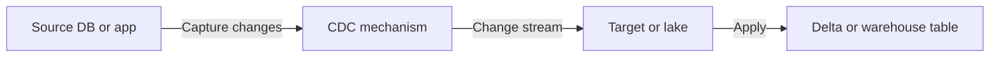
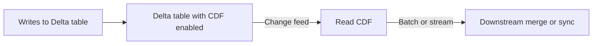
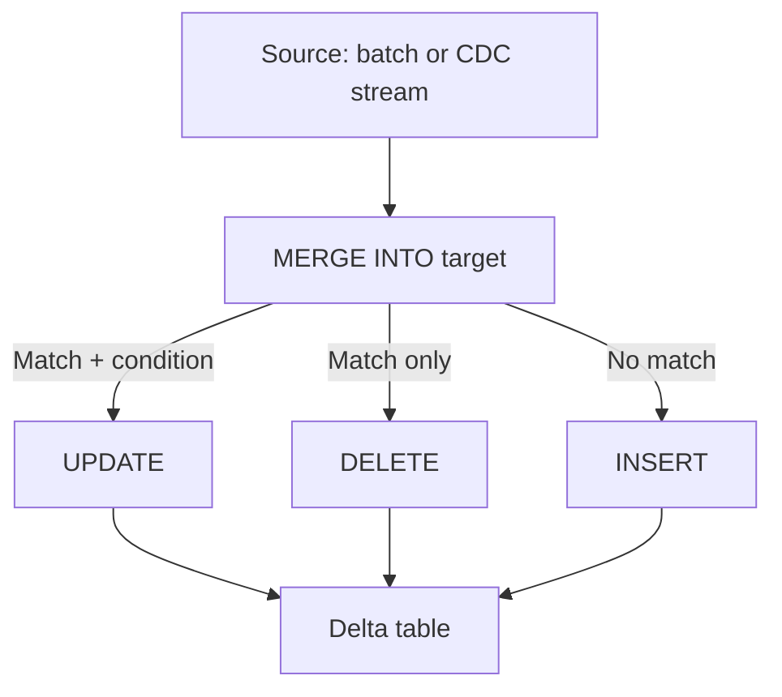
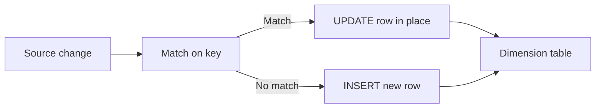
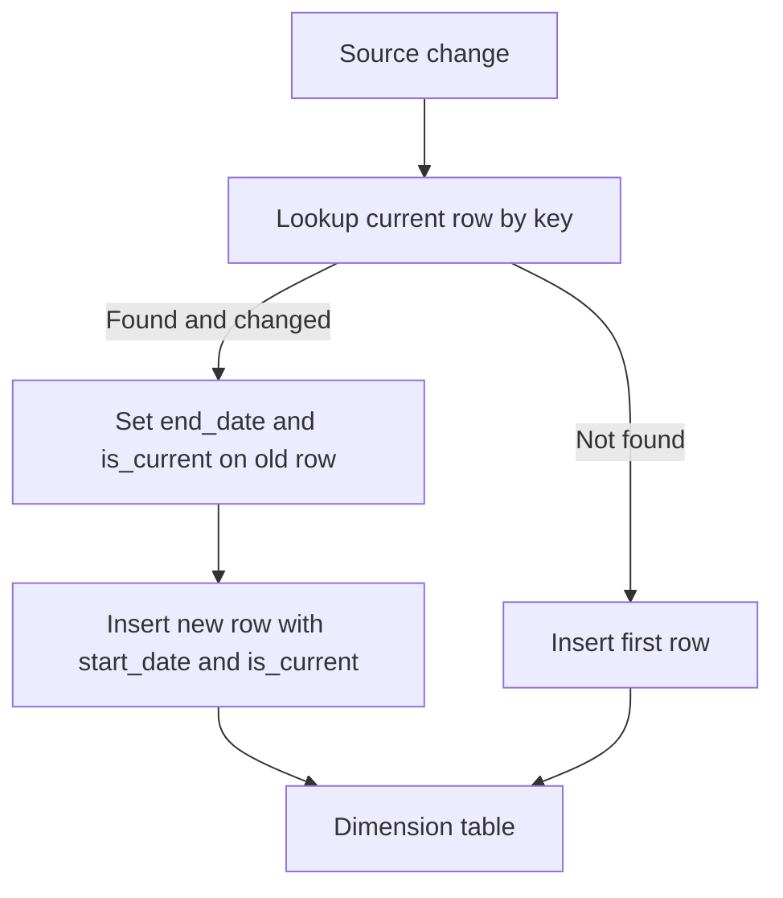
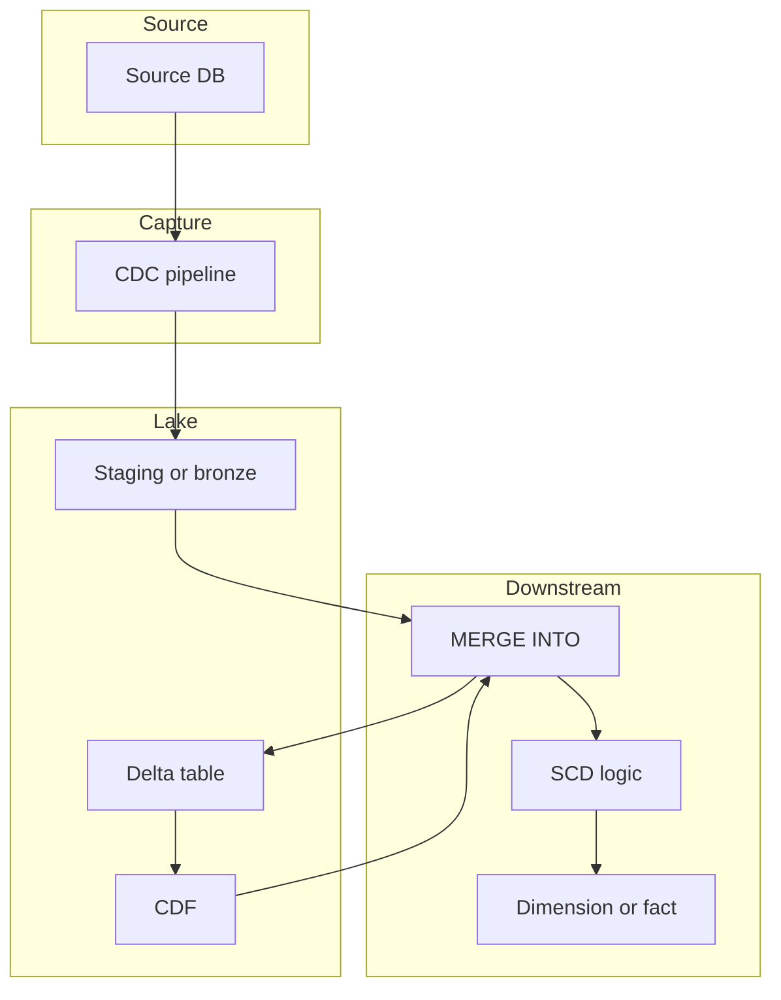

# CDC, CDF, Delta Merge, and SCDs

This document covers **Change Data Capture (CDC)**, **Change Data Feed (CDF)**, **Delta Lake merge**, and **Slowly Changing Dimensions (SCDs)**—what they are, how they flow, and why we use them.

---

## 1. Change Data Capture (CDC)

### What it is

**CDC** is the process of identifying and capturing **only the data that changed** in a source system (inserts, updates, deletes) so downstream systems can process just those changes instead of full reloads.

### Why use CDC

- **Efficiency:** Move only changed rows; less data transfer and less processing than full refresh.
- **Latency:** Downstream can stay near real-time by continuously applying changes.
- **Load:** Reduces load on source and target compared to full table scans or dumps.

### Flow (high level)



**Typical CDC flow (log-based):**

1. **Source** produces changes (transactions, application events).
2. **Capture** reads from transaction log (e.g. Oracle redo, MySQL binlog, Debezium) or change tables (e.g. SQL Server CDC tables).
3. **Stream** of change events (insert/update/delete + key + old/new values) is published (Kafka, Kinesis, or file).
4. **Target** consumes the stream and applies changes (merge into Delta, update warehouse, etc.).

**Ways to capture changes:**

| Method | How it works | Typical use |
|--------|----------------|-------------|
| **Log-based** | Read DB transaction log | Low impact, near real-time |
| **Trigger-based** | Triggers write to change table | When log access not allowed |
| **Timestamp / version** | Poll for `updated_at` or version | Simpler but can miss deletes or same-second updates |
| **Diff (full compare)** | Compare full snapshot to previous | No log; high cost for large tables |

---

## 2. Change Data Feed (CDF) – Delta Lake

### What it is

**CDF** is a Delta Lake feature that records **row-level change events** (insert, update, delete) in a Delta table. You can read these events as a stream or batch to build downstream pipelines without re-reading the entire table.

### Why use CDF

- **Downstream CDC:** Other tables or systems can consume only changes from a Delta table.
- **Audit / compliance:** Know what changed, when, and how (insert/update/delete).
- **Silver/gold layers:** Incrementally build layers from Delta tables using change feed instead of full scans.
- **Replication:** Sync changes to another Delta table or system.

### Flow (high level)



**How it works:**

1. **Enable CDF** on the Delta table (at create time or via `ALTER TABLE`). Delta then records change metadata (e.g. `_change_type`, operation metrics) and exposes it via the change feed API.
2. **Writes** (INSERT, UPDATE, DELETE, MERGE) produce change events that are part of the table’s transaction log.
3. **Read CDF** via:
   - **Batch:** `table_changes('table_name', start_version, end_version)` in a query.
   - **Streaming:** Read the Delta table as a stream with `readChangeFeed = true`.
4. **Downstream** merges changes into another Delta table, writes to a warehouse, or forwards to Kafka etc.

**When to use CDF vs external CDC**

- **CDF:** Your source of truth is already a Delta table; you want to expose its changes to other Delta tables or jobs.
- **CDC:** Your source is an external system (RDBMS, app); you need to capture its changes first, then land them (e.g. into Delta via merge).

---

## 3. Delta Merge (MERGE INTO)

### What it is

**Delta merge** is the `MERGE INTO` operation on a Delta table: for each row in the **source** (e.g. a batch of CDC events or a staging table), decide whether to **insert** (no match), **update** (match), or **delete** (match + condition), in a single atomic operation.

### Why use Delta merge

- **Upserts:** Insert new rows and update existing ones in one pass, without full overwrite.
- **Idempotency:** Re-running the same batch of changes produces the same result; safe for retries and exactly-once semantics.
- **Performance:** Only touched partitions are rewritten; rest of the table is unchanged.
- **Consistency:** Single transaction; no window where the table is half-updated.

### Flow (high level)



**Typical merge flow:**

1. **Source:** Micro-batch of CDC events, or a staging table that was loaded from files/stream.
2. **Dedupe / key:** Optionally deduplicate by key and keep latest (e.g. by `updated_at` or sequence).
3. **MERGE INTO target**
   - `ON` target.key = source.key (and optionally other conditions).
   - `WHEN MATCHED AND <condition>` THEN UPDATE SET ...
   - `WHEN MATCHED AND <delete_condition>` THEN DELETE
   - `WHEN NOT MATCHED [BY TARGET]` THEN INSERT ...
4. **Result:** Delta table updated in place; only affected files rewritten.

**Example (conceptual):**

```sql
MERGE INTO target t
USING source_batch s ON t.id = s.id
WHEN MATCHED AND s._change_type = 'delete' THEN DELETE
WHEN MATCHED THEN UPDATE SET t.col = s.col, t.updated_at = s.updated_at
WHEN NOT MATCHED THEN INSERT (id, col, updated_at) VALUES (s.id, s.col, s.updated_at)
```

---

## 4. Slowly Changing Dimensions (SCDs)

### What they are

**SCDs** are patterns for storing **dimension** data that **changes over time** in a data warehouse, so you can track history (or not) depending on the type.

### Why use SCDs

- **History:** Answer “what did this attribute look like at a given time?” (SCD Type 2).
- **Current view:** Only latest state (SCD Type 1) for simpler reporting.
- **Audit:** Who changed what and when (often with Type 2 or hybrid).

### Types (short)

| Type | Behavior | Use when |
|------|----------|----------|
| **Type 1** | Overwrite; no history | Only current state matters |
| **Type 2** | New row per change; history kept | Point-in-time and history queries |
| **Type 3** | Keep previous value in extra column | Need “current + one prior” only |
| **Type 4** | History in separate table | Current in main dim, full history in history table |
| **Type 6** | Hybrid (1 + 2 + 3 style columns) | Current, effective range, and previous value in one row |

---

### SCD Type 1 – Overwrite (no history)

**Idea:** When a dimension attribute changes, **overwrite** the existing row. No history.

**Flow:**



**Reason:** Simplest; reporting always sees “current” state. Use when history is not required.

---

### SCD Type 2 – New row per change (full history)

**Idea:** When an attribute changes, **do not** overwrite. **Insert a new row** with the same business key; mark the old row as no longer current (e.g. `end_date`, `is_current`).

**Flow:**



**Typical columns:**

- Surrogate key (e.g. `dim_key`) – unique per row.
- Business key (e.g. `customer_id`).
- Attributes (e.g. `name`, `region`).
- `start_date`, `end_date` (or `effective_from`, `effective_to`).
- `is_current` (e.g. 1 = current, 0 = historical).

**Reason:** Supports “as of” and point-in-time reporting and full history. Use for dimensions where you need to join facts to the dimension state that was valid at the fact’s time.

---

### SCD Type 2 with Delta merge (practical flow)

**Flow:**

1. **Source:** CDC or batch load with business key + changed attributes.
2. **Identify changes:** Join to current dimension rows (`is_current = 1`). Compare attributes; if different, the row is an “update” for Type 2.
3. **Merge:**
   - **Match + changed:** UPDATE existing current row SET `end_date = batch_date`, `is_current = 0`; INSERT new row with new attributes, `start_date = batch_date`, `is_current = 1`.
   - **No match:** INSERT new row with `start_date`, `is_current = 1`.
4. **Deletes (optional):** If source sends deletes, set `end_date` and `is_current = 0` on the current row (soft delete).

**Reason:** Delta merge gives a single atomic operation and only rewrites affected partitions; CDF/CDC supplies the changes so you only process what changed.

---

## 5. How CDC, CDF, Delta merge, and SCDs fit together



- **CDC** brings changes from the source into the lake (e.g. staging/bronze).
- **Delta merge** applies those changes to a Delta table (upsert/delete).
- **CDF** exposes changes from that Delta table for further downstream consumption.
- **SCD** is the **logic** you implement inside (or on top of) merge: Type 1 = update in place; Type 2 = end-date old row + insert new row; etc.

**Reasons in one sentence:** CDC and CDF limit work to **changes**; Delta merge applies those changes **efficiently and atomically**; SCDs define **how** dimension history (or lack of it) is stored and queried.

---

## Next steps

Once you're comfortable with CDC, CDF, Delta merge, and SCDs, move on to the next topic in your study plan (e.g. **Topic 8: Python for Data Engineering** or **Advanced SQL**). Practice implementing merge and SCD Type 2 in Spark/Delta.
